<!-- Generated by src/readme.ts. Do not edit by hand: change content.json and run npm run build. -->
<picture>
  <source media="(prefers-color-scheme: dark)" srcset="assets/session-dark.svg">
  <source media="(prefers-color-scheme: light)" srcset="assets/session-light.svg">
  
</picture>
